# Procesverslag
Markdown is een simpele manier om HTML te schrijven.  
Markdown cheat cheet: [Hulp bij het schrijven van Markdown](https://github.com/adam-p/markdown-here/wiki/Markdown-Cheatsheet).

Nb. De standaardstructuur en de spartaanse opmaak van de README.md zijn helemaal prima. Het gaat om de inhoud van je procesverslag. Besteedt de tijd voor pracht en praal aan je website.

Nb. Door *open* toe te voegen aan een *details* element kun je deze standaard open zetten. Fijn om dat steeds voor de relevante stuk(ken) te doen.

## Jij

  
uitwerken voor kick-off werkgroep

  ### Auteur:
  Sjoerd van Rooij

  #### Je startniveau:
  Rood
  #### Je focus:
  surface plane
 

## Je website

  
uitwerken voor kick-off werkgroep

  ### Je opdracht:
  https://app.destinyitemmanager.com/
  (https://app.destinyitemmanager.com/4611686018498828332/d2/inventory)

  #### Screenshot(s) van de eerste pagina (small screen): 
  inventory
  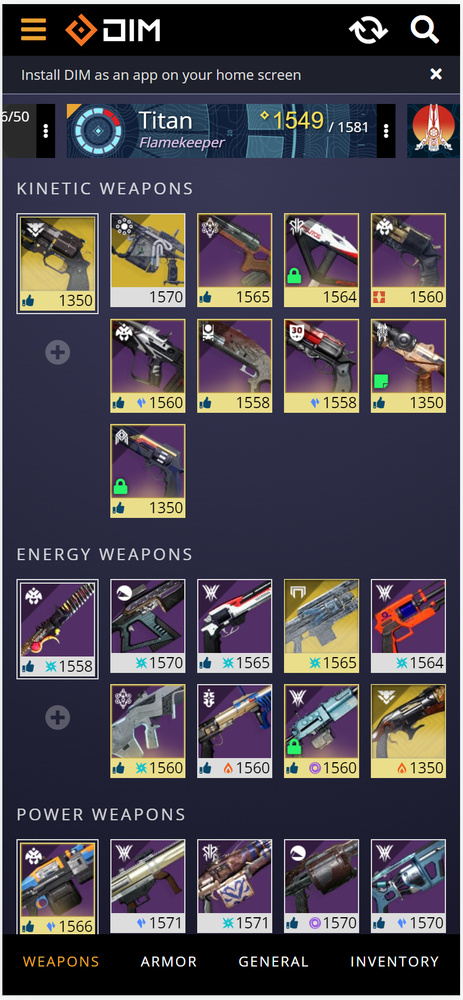

  #### Screenshot(s) van de tweede pagina (small screen):
  loadout 
  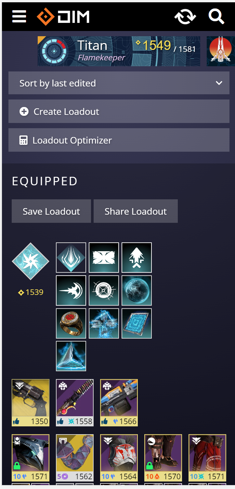
 

## Toegankelijkheidstest 1/2 (week 1)

  
uitwerken na test in 1e werkgroep

  ### Bevindingen
  Lijst met je bevindingen die in de test naar voren kwamen:
  
  Niet of slecht bedienbaar met toetsebord.
  Werkt slecht met screenreader.

  De webpagina werkt redelijk als je kleuren blind bent alleen de blauwe en paarse angrams zien er het zelfde uit.
  
  Het contrast op de pagina is groot texst is vaak wel klijn.

  #### Screenreader
  Hier korte omschrijving (met indien nodig afbeeldingen)
  De screenreader kan het meerdendeel van de pagina niet lezen, de pagina bestaat uit div elementen die geen waarden hebben voor de screen reader en die niet met tab kunnen worden geselecteerd.

  Hier een omschrijving van hoe het opgelost kan worden (met indien nodig afbeeldingen)

  Sematiese html schrijven afbeeldingen met beschrijvingen gebruiken in de plaats van div elementen sectoins en articels kunnen hier ook bij helpen. 

  #### Muis en Toetsenbord 
  Hier korte omschrijving (met indien nodig afbeeldingen)
  Werkt niet goed somige elementen laten wel zien dat ze geselecteerd zijn maar het meerden deel niet.

  Hier een omschrijving van hoe het opgelost kan worden (met indien nodig afbeeldingen)
  states toevoegen zo dat de usser kan zien wat hij/zij geselcteerd heeft

  #### Motoriek (shocks, elastiekjes)
  Hier korte omschrijving (met indien nodig afbeeldingen)
  Deze werkte helemaal niet met een standaart laptop toetsebord.

  Hier een omschrijving van hoe het opgelost kan worden (met indien nodig afbeeldingen)
  Een meganies toetsebord gebruiken met een stijve veer zou hier helpen.

  #### Visueel (brillen, contrast, kleurenblind, dark/light). 
  Hier korte omschrijving (met indien nodig afbeeldingen)
  Hier haden we wijnig tot geen problemen er zijn een aantal elementen de engrams die een verandering in kleur nodig hebben maar voor de rest niet zo veel wel wordt de texst heel klijn.
  Hier een omschrijving van hoe het opgelost kan worden (met indien nodig afbeeldingen)
  texst vergroten naar min 0.8em en standaart 1em engrams kleur aan passen.

## Breakdownschets (week 1)

  
uitwerken na afloop 2e werkgroep

  ### de hele pagina: 
  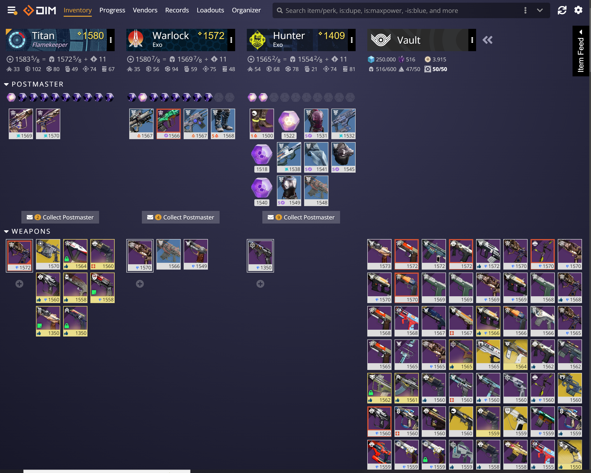

  ### de hele pagina mobiel: 
  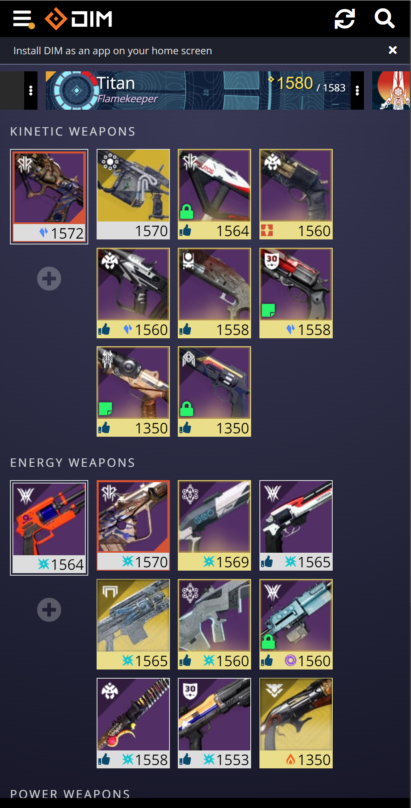

  ### navigatie groot scherm: 
  

  ### navigatie mobiel:
  

## Voortgang 1 (week 2)

  
uitwerken voor 1e voortgang

  ### Stand van zaken
  vragen stelen ging moeizaam ik moet me zelf aanwennen om eerder en vaaker iets te vragen.

  ### Agenda voor meeting
  samen met je groepje opstellen

  | student 1      | student 2          | student 3    | student 4        |
  | ---kopt mijn html| ---wat moet ik veranderen       | ---          | ---              |
  | dit bespreken  | en dit             | en ik dit    | en dan ik dat    |
  | en dat ook nog | dit als er tijd is | nog een punt | dit wil ik zeker |
  | ...            | ...                | ...          | ...              |

  ### Verslag van meeting
  hier na afloop snel de uitkomsten van de meeting vastleggen

  - punt 1 Probeer grid meer te gebruiken.
  - punt 2 schrijf meteen nete code.

## Voortgang 2 (week 3)

  
uitwerken voor 2e voortgang

  ### Stand van zaken
  hier dit ging goed & dit was lastig (neem ook screenshots op van delen van je website en code)
  
  Ben deze week ziek geweest en weet niet zeker of dat ik nog op schema lig.
  Heb veel met grid gewerkt en heb nu het gevoel dat ik het aardig in de vingers heb.

  ### Agenda voor meeting
  samen met je groepje opstellen

     
  |Animatie|Positoinering|Media queries |alt labels|
  
  

  ### Verslag van meeting
  hier na afloop snel de uitkomsten van de meeting vastleggen

  - veranderen structuur naar colommen alles buiten de header moet in 4 colommen worden gezet als de pagina klijner wordt gaat hij over naar een carosel(media querie).
  nav moet geen nav zijn maar een ul.
  section in de header mag een nav zijn.
- ...

## Toegankelijkheidstest 2/2 (week 4)

  
uitwerken na test in 8e werkgroep

  ### Bevindingen
  Lijst met je bevindingen die in de test naar voren kwamen (geef ook aan wat er verbeterd is):
  mijn menu moet in de html meteen na de knop waar mee je hem opent anders is het heel raar als je er door heen tabt

  #### Screenreader
  Toevoegen van headings aan alle secties anders is het onmogelijk om met een screen reader op een logiese manier te navigeren.
  
  Hier een omschrijving van hoe het opgelost kan worden (met indien nodig afbeeldingen)

  #### Muis en Toetsenbord 
als je het menu opent via het toetsebord en je wil naar de menu items tabben ga je eerst alle andere buttons en links af voor dat je bij de menu items komt.

oplosing:
mijn menu moet in de html meteen na de knop waar mee je hem opent anders is het heel raar als je er door heen tabt

  #### Motoriek (shocks, elastiekjes)
  We haden geen probleem met het navigeren van de web pagina met elastiekjes. 
  Ik heb er voor gekozen om de afbeeldingen waar je op moet kunnen druken/kliken groter te maken
  spcaifiek op mobiel formaat dit geeft de gebruiker meer ruimten om mis te kliken en tog te krijgen.

  Met shocks word het heel lastig zeker op de toetseborden van onze laptops. 
  Een ding dat zou kunnen helpen is een mechanies toetsebord met aanslag op de trugkomst indepaats van aan komst,
  dit in kombinatie met een stijve toets weerstand zou het makelijker maken om de pagina te bedienen.

  Ik weet zelf niet goed hoe behalven door items grooter te maken het makelijker kan maken
  voor iemand die hier last van heeft. Ik zal zeker zelf nog litratuur hier over opzoeken en hier een vraag overstelen tijdens het volgende voortgangs gesprek.
  
  #### Visueel (brillen, contrast, kleurenblind, dark/light). 
  over het algemeen ging dit goed:
  maar bij slecht ziend heid zijn somige teksten klijn of moelijk leesbaar.

  kleurenblindheid:
  dit ging goed het enige punt dat ik zou verbeteren is:
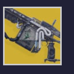
de border valt hier weg ik zou hier een donkere border gebruiken zo dat het duidelijk is dat hij geselecteerd is.
de oplosing zou een clas='goud' voor gebruiken de goude afbeeldingen komen over meerdere pagina's voor op random pleken

## Voortgang 3 (week 4)

  
uitwerken voor 3e voortgang

  ### Stand van zaken
  Het is gelukt om de web pagina resonsive te maken, mobiel heeft nu een carosel

ik moet mijn tweede pagina nog afmaken de html is grotendeels klaar(er ontbreken een nog een paar afbeeldingen).
daar naast wil ik nog een dark mode toevoegen. Ikk heb verder gewerkt aan de html en css van de tweede pagina nu moet ik nog:
-controleren of dat ik alle secties een heading heb gegeven.
-een dark mode maken
-de re-load animatie maken
-css en html valideren
-Opmerkingen van Sane verwerken
-brone lijst aanvullen
-eindgesprek voorbereiden
-document op github zetten

  ### Agenda voor meeting
  samen met je groepje opstellen

  | student 1      | student 2          | student 3    | student 4        |
  | ---            | ---                | ---          | ---              |
  | dit bespreken: mag ik tab index gebruiken om een afbeelding interactief te maken? | en dit             | en ik dit    | en dan ik dat    |
  | en dat ook nog: ik heb een laad link waar ik de styling van rond wil laten draaien op het moment dat je er op klikt ik heb de code penetjes van week 3 bekeeken maar kom er zelf niet uit | dit als er tijd is: is mijn html nog steeds vies? ik wil graag schone html leren schrijven :) | nog een punt | dit wil ik zeker |
  | ...            | ...                | ...          | ...              |

  ### Verslag van meeting
  hier na afloop snel de uitkomsten van de meeting vastleggen

  - punt de inventory afbeeldingen in een button zetten met een section er omheen werk een foldout menu uit en maak notitie van welke je hebt uit gewerkt. 
  - punt zorg er voor dat al je sections een h hebben
  - nog een punt maak de animatie af voor de laad knop triger load page
  - ...

## Eindgesprek (week 5)

  
uitwerken voor eindgesprek

  ### Je uitkomst - karakteristiek screenshots:
  
  
  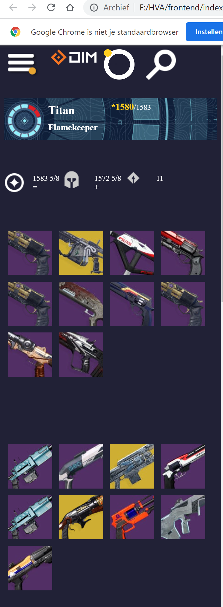

  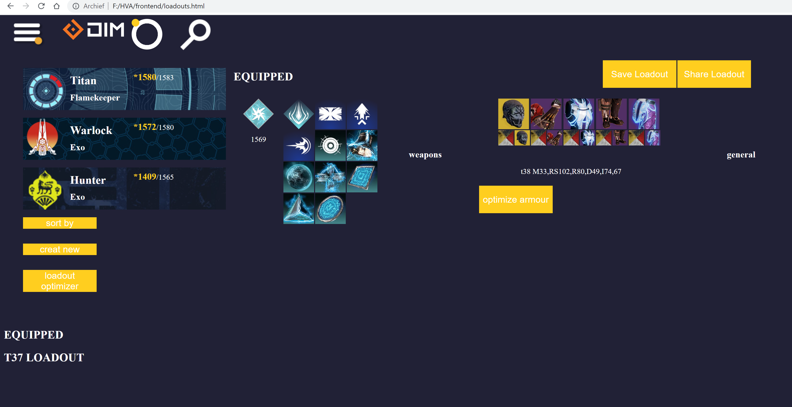
  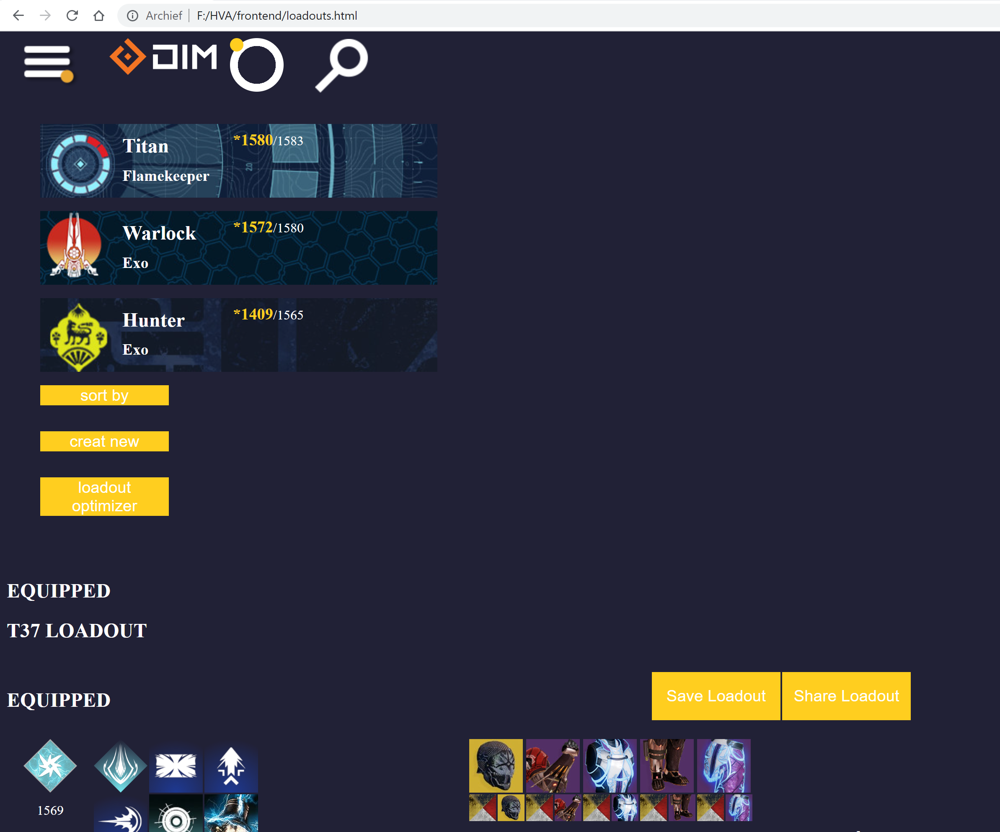
  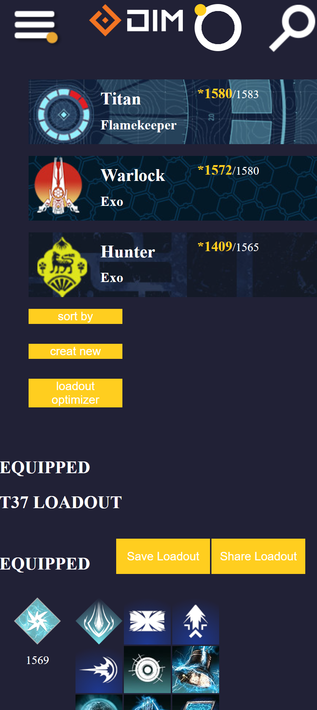

  ### Dit ging goed/Heb ik geleerd: 
  Korte omschrijving met plaatjes
  Het gebruiken van media qweries en grid en flex box ging goed ik heb het gevoel dat ik hier veel voort gang in heb gemaakt.
  Zo heb ik in de onderstaande foto's media qweries flexbox en grid gebruikt om op bepaalde schermgrootes het beeld te laten verspringen 
  om zo gebruik te maken van de ruimte van het beeld en altijd de inforamtie leesbaar te houden.

  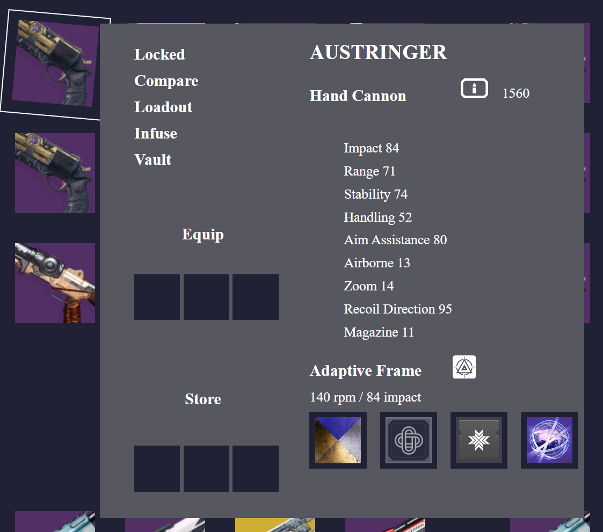
  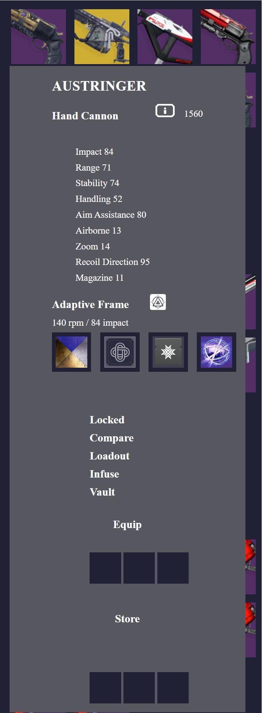

  ### Dit was lastig/Is niet gelukt:
  Korte omschrijving met plaatjes
  Ik wouw de onderstaande afbeelding animeren zo dat die zo dra de pagina gelaaden was zou gaan rond draaien dit is me niet gelukt en ik wil 
  in de toekomst meer oefenen met css animties en jss.
  

## Bronnenlijst

  
continu bijhouden terwijl je werkt

  Nb. Wees specifiek ('css-tricks' als bron is bijv. niet specifiek genoeg).

  1. bron 1 code bron: oefening 13 https://codepen.io/shooft/pen/VwXXNea*/ (zie hompage_style.css)
  2. bron 2
  3. ...

